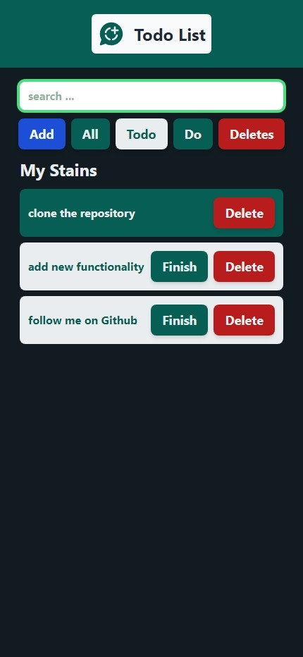

# Todo List App

Ce projet est une application de gestion de tâches (**Todo List**) construite avec **React.js** et stylisée avec **Tailwind CSS**. L'application permet aux utilisateurs d'ajouter, de terminer et de supprimer des tâches de manière simple et efficace.

## Aperçu



## Badges


## Fonctionnalités

- **Ajouter des tâches** : Ajoutez une nouvelle tâche à la liste.
- **Marquer comme terminée** : Marquez une tâche comme terminée avec le bouton "Finish".
- **Supprimer des tâches** : Supprimez des tâches grâce au bouton "Delete".
- **Filtrage** : Filtrez les tâches en fonction de leur statut (toutes, terminées, non terminées).
- **Recherche** : Recherchez une tâche via la barre de recherche.

## Technologies utilisées

- **React.js** : pour le développement de l'interface utilisateur.
- **Tailwind CSS** : pour un style rapide et réactif.
- **JavaScript (ES6)** : pour la logique de l'application.

## Prérequis

- [Node.js](https://nodejs.org/) (version 12 ou supérieure)
- [npm](https://www.npmjs.com/) ou [yarn](https://yarnpkg.com/)

## Installation

1. Clonez le repository :
   ```bash
   git clone https://github.com/ton-utilisateur/todo-list.git
   ```

2. Accédez au répertoire du projet :
   ```bash
   cd todo-list
   ```

3. Installez les dépendances :
   ```bash
   npm install
   ```

4. Installez **Tailwind CSS** :
   Si Tailwind n'est pas déjà configuré, suivez les étapes ci-dessous :

   - Ajoutez Tailwind via npm :
     ```bash
     npm install -D tailwindcss
     npx tailwindcss init
     ```

   - Configurez Tailwind dans le fichier `tailwind.config.js` :
     ```js
     module.exports = {
       content: ["./src/**/*.{js,jsx,ts,tsx}"],
       theme: {
         extend: {},
       },
       plugins: [],
     };
     ```

   - Importez Tailwind dans le fichier CSS principal :
     ```css
     @tailwind base;
     @tailwind components;
     @tailwind utilities;
     ```

## Exécution de l'application

Pour lancer l'application en mode développement :

```bash
npm start
```

Cela ouvrira l'application sur [http://localhost:3000](http://localhost:3000).

## Build pour la production

Pour créer une version optimisée de l'application pour la production :

```bash
npm run build
```

## Améliorations futures

- **Ajout de priorités** : Possibilité de définir des niveaux de priorité pour chaque tâche.
- **Sauvegarde persistante** : Intégrer `localStorage` ou une base de données pour sauvegarder les tâches.
- **Dark mode** : Ajouter un mode sombre pour améliorer l'expérience utilisateur.

## Contribution

Les contributions sont les bienvenues ! Si vous avez des idées pour améliorer l'application, vous pouvez soumettre une **pull request** ou ouvrir une **issue**.

---